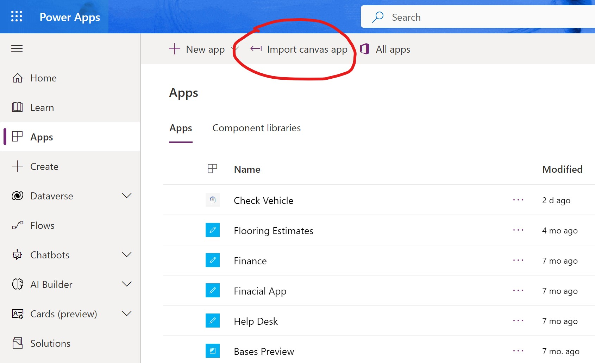
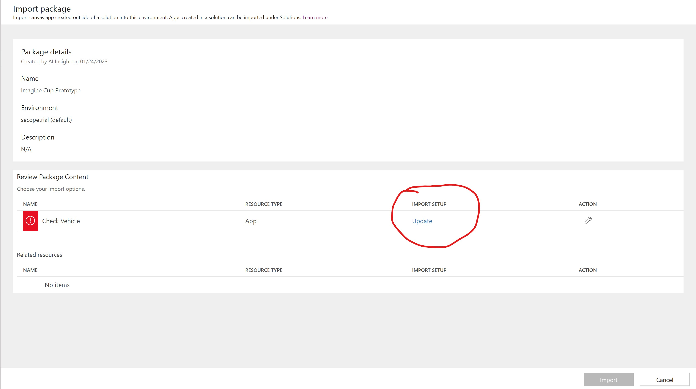
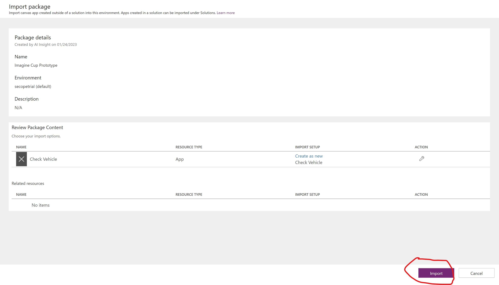
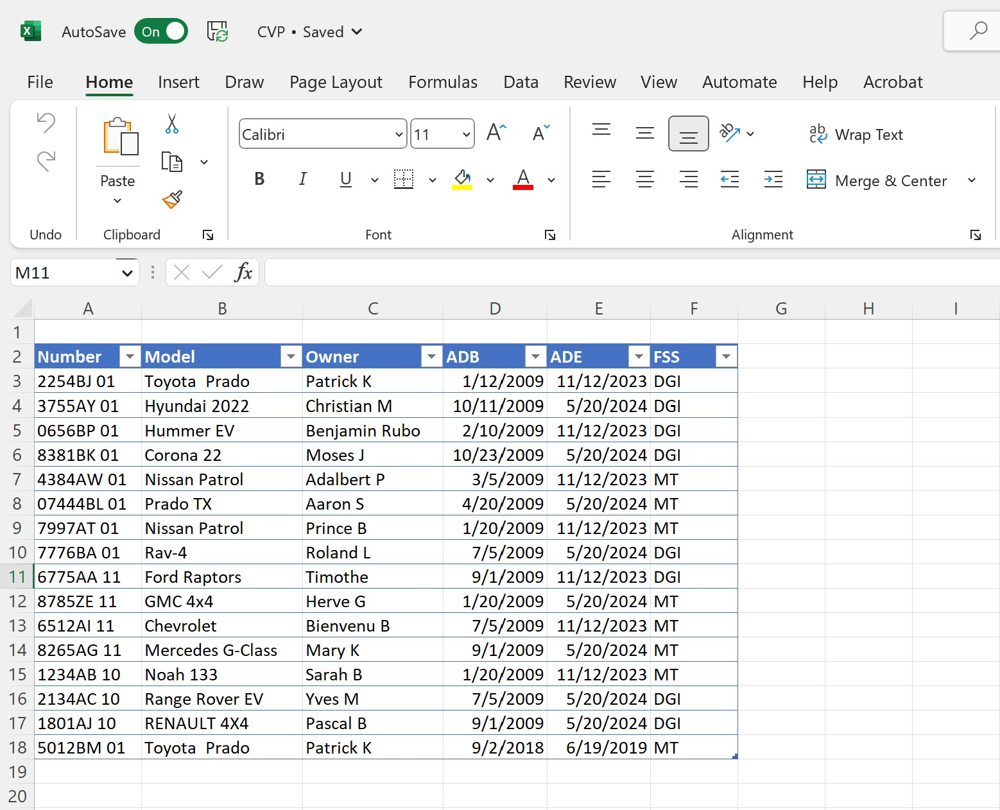
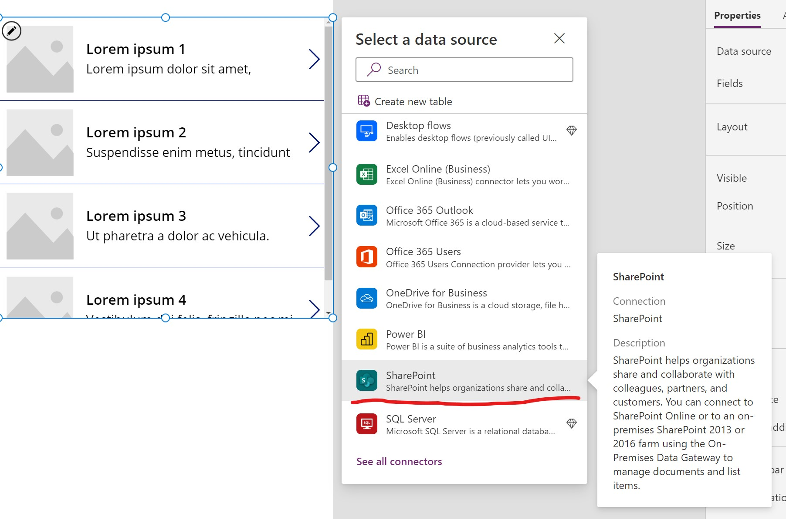

## How to import the apps in Power Apps?
To import an app in Power Apps, you can follow these steps:
 - Log in to Power Apps from the web portal (https://web.powerapps.com/) you can use this credentials:`imaginecup@windowslearning.codes`type this password:  `Prototype@2023`

 - Once logged in, click on the "Apps" button on the left-hand side menu.

 - Click on the "Import" button located in the top right corner of the screen.
 

- In the import dialog box, you will be prompted to choose the app file you want to import. The file should have a .msapp or .zip file extension. You can select the file by browsing through the file explorer or by dragging and dropping the file into the dialog box.

 - Once you have selected the file, click the "Open" button.

 - The import process will begin, and you will see a progress bar indicating the status of the import. This process might take a few minutes, depending on the size of the app and the number of files it contains.
  
 
 - You'll need to click on update, once done you will create a new environment because that database it comes from externetal environment or you don't have access
  
 - Once the import process is complete, the app will be added to your list of apps, and you will be able to open it and start using it.

 - To open the app, click on the app name in the list of apps, this will take you to the app's home screen.

## How to have the same database?
In easy way like for our Prototype it is to use SharePoint list, then you'll upload an Excel list.
Go to the SharePoint website where the list is located.

  - Click on the "Lists" or "Apps" link on the top navigation bar, then find and click on the link for the list where you want to upload the Excel file.

  - On the list page, click on the "Files" tab in the top ribbon, then click on the "New Document" button.

  - In the "New Document" menu, select "Excel" to create a new Excel file in the list `(The file demos it is on the folder Prototype )`for example.
  
  
  - If you want to upload an existing Excel file, click on the "Upload Document" button, then select the file from your computer by clicking on the "Browse" button.`(The file demos it is on the folder Prototype )`
  

   - Once you have selected the Excel file, click on the "OK" button to begin the upload process.

  - Wait for the upload to complete, then you will see the Excel file listed on the list.

  - You can open the file by clicking on its name, and you will be able to view, edit and share the document with others.

Note: Make sure that you have the necessary permissions to upload files to the SharePoint list. Also, if the option to upload files is not available in the list, you may need to contact your SharePoint administrator to have the necessary permissions enabled.
## Connect to the Prototype?
once you've done all the process you can now connect your list with `Gallery` in the Screen `Checking Vehicle Process` and the copy and past the link of your SharePoint url.
 
